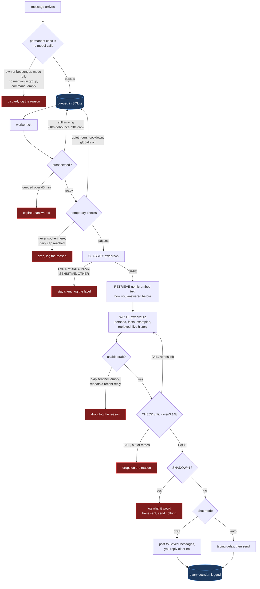
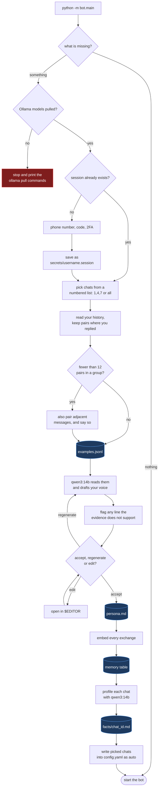

# Architecture

The diagrams in the README answer "what does this do". These answer "where did
my message go", which is the question you actually have once it is running.

Almost every message ends somewhere other than "sent". That is the design, not
a failure: a missed reply costs nothing, and a wrong one goes out under your
name and cannot be recalled. Every path below that stops early is a place the
bot decided silence was the better answer, and every one of them is written to
SQLite with its reason. `/last` shows them.

## The reply pipeline

### The two gates

They look similar and do opposite things.

`should_enqueue` in `bot/gate.py` runs on every incoming message, makes no
network calls, and its rejections are **permanent** — the message is dropped
and never reconsidered. It covers things that will not change by waiting: the
sender is you or a bot, the chat is off, nobody mentioned you in a group.

`may_dispatch` runs when a batch is about to be answered, and most of its
rejections are **temporary**. Quiet hours and cooldowns put the batch back in
the queue to be retried on a later tick. Three do not: a chat you have never
spoken in, and the daily caps, per chat and global, are dropped rather than
held, because holding a message for something that will not become true again
today just fills the queue.

### Why messages wait

The bot never answers on arrival. A batch is only ready once the sender has
been quiet for `queue_debounce_seconds`, so a burst still being typed is not
answered halfway through, or once the oldest message has waited
`queue_max_wait_seconds`, so a fast typist is not ignored forever. Everything
pending for one chat is then coalesced into a single reply.

When several chats are ready at once, `choose` ranks them: DMs first, then
replies to you, then plain mentions, then whoever waited longest.

### The retry loop

The critic in `bot/verify.py` reads the draft back against the conversation
and answers PASS or FAIL with a reason. On FAIL the reason is handed back to
the writer as feedback and it tries again, up to `verify_max_retries`. If it
still fails, nothing is sent. This costs an extra model call per reply, which
is the trade `verify_enabled` exists to let you refuse.

## First-run setup

The steps are gated on the files they produce, so setup is resumable: run it
again after a crash and it skips whatever already exists. `--setup` forces
every step to run again.

Two details worth knowing. The Ollama check happens *before* the first
question, so you cannot answer the whole interview and then discover the model
was never pulled. And the login writes to a temporary session file, because
Telegram only says who you are after you have authenticated — the file is
renamed to `secrets/<username>.session` once the account is known.

### Driving setup from something other than a terminal

No setup step prints or reads input itself. Every question goes through the
`Prompter` protocol in `bot/setup.py`, and `ConsolePrompter` is the only
implementation that touches a terminal. Telethon's login callbacks are async
for the same reason. A web frontend means writing a second `Prompter`; none of
the steps change.

## Where the code lives

See the file map in [README.md](README.md#files).
