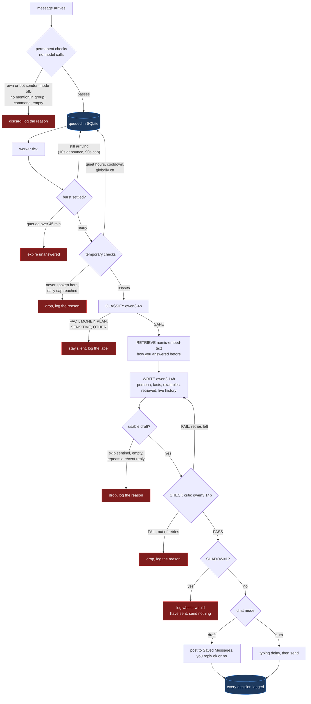
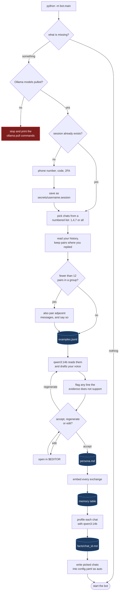

# telegram-reply

A Telegram userbot that replies from your own account using local models on
your machine.

This logs in as you, not as a bot account, and sends under your own name.
Telegram tolerates third-party clients but flags accounts that behave like
spam, so try not to reduce the ratelimits. The people you talk to won't know
a model wrote the reply.

**Requirements:** macOS, Linux, or Windows · Python 3.11 to 3.14 · Ollama ·
~12 GB free disk for the three models.
16 GB RAM is the realistic floor for `qwen3:14b`; on 8 GB use `qwen3:8b`.

## How it works




## Setup

**Install Python (macOS / Linux)**

```bash
python3 -m venv .venv
source .venv/bin/activate
pip install -r requirements.txt
```

**Install Python (Windows PowerShell)**

```powershell
py -3.12 -m venv .venv
.venv\Scripts\Activate.ps1
pip install -r requirements.txt
```

If PowerShell refuses to run the activate script:
`Set-ExecutionPolicy -Scope CurrentUser RemoteSigned`.

**1. Credentials.** my.telegram.org → API development tools. Need to create a .env file.

```bash
cp .env.example .env            # Windows:  copy .env.example .env
```

Fill in `TG_API_ID` and `TG_API_HASH`. Everything else in that file has a
working default and is commented out.

`SHADOW=1` (the default) writes and logs replies but never sends them. Leave
it on until you have read a few and are happy with what it would have said.
`SHADOW=0` lets them out.

Sending and approval are separate things. A chat set to `draft` in
`config.yaml` posts its reply to your Saved Messages first — answer `ok` to
send it, `no` to drop it, or type your own version and that goes instead. A
chat set to `auto` sends with no approval step, and setup puts the chats you
pick on `auto`. On a fresh install `SHADOW=1` is the only thing between the
bot and live messages.

Fix how it sounds by editing `persona.md`.

`LOG_PROMPTS=1` dumps every prompt and raw model output to `logs/prompts/`,
which is the only way to see what the model actually received.


**2. Install Models.**

macOS: `brew install ollama && brew services start ollama`
Linux: `curl -fsSL https://ollama.com/install.sh | sh`
Windows: download the installer from ollama.com. It runs as a background
service automatically.

Then, on any platform:

```bash
ollama pull qwen3:14b          # writer
ollama pull qwen3:4b           # classifier
ollama pull nomic-embed-text   # retrieval
```

**3. Start it.**

```bash
python -m bot.main
```



That is the whole setup. On a fresh install the bot notices what is missing,
walks you through it, and then starts in the same run:

1. **Login** — Telegram texts you a code. The session is saved as
   `secrets/<your-username>.session`, named after whoever logged in.
2. **Pick chats** — your chats are listed with numbers; type `1,4,7`, `1-5`,
   or `all`. Groups you actually talk in give the best result.
3. **`examples.jsonl`** — finds places where someone spoke and you answered.
4. **`persona.md`** — the local model reads those examples and drafts your
   voice, then shows it to you before anything is written: accept, regenerate,
   or open it in `$EDITOR`. **Read it.** It goes into every prompt, and the
   model may have invented habits you do not have.
5. **`facts/` and retrieval memory** — embeds your history and writes a profile
   per chat. **Read those too**, for the same reason.
6. **`config.yaml`** — the chats you picked are set to `auto`.

`auto` sends replies as you, with no approval step. Set a chat to `draft` in
`config.yaml` to approve each one from Saved Messages instead, or keep
`SHADOW=1` in `.env` so nothing sends at all while you watch what it would say.

Setup only runs the steps whose files are missing, so if it dies halfway
through, just run it again.

| flag | effect |
|---|---|
| `--setup` | redo every step, overwriting what is already there |
| `--setup-only` | set up and exit, without starting the bot |
| `--no-setup` | never prompt; exit listing what is missing (servers, CI) |

### Re-running one piece

The scripts are still there for finer control, and run the same code the
wizard does:

```bash
python -m scripts.login                             # re-auth, or switch account
python -m scripts.export_examples --groups --list   # list chats and their ids
python -m scripts.export_examples --groups --chat "uni bois" --per-dialog 25 --loose
python -m scripts.build_context --chat "uni bois" --scan 8000 --profile
```


## Reading Logs

```bash
sqlite3 -header -column secrets/state.db \
  "select reason, count(*) n from events where decision='skipped'
   group by 1 order by n desc;"
```

Windows has no bundled `sqlite3` CLI, so use Python instead:

```powershell
python -c "import sqlite3;[print(r) for r in sqlite3.connect('secrets/state.db').execute(\"select reason,count(*) from events where decision='skipped' group by 1 order by 2 desc\")]"
```

`classifier: PLAN` dominating means that group is mostly logistics. `model
chose to skip` dominating means the persona is too strict. `cooldown`
dominating means you're throttled too hard.

## Config
There is this yaml file for config which denotes what the chat is supposed to do.
You may try tweaking the settings (like chat cooldown, chat mode etc.)
to see what the bot does.

## Commands

Typed into your own Saved Messages. The leading `/` is optional for short ones.

| command | effect |
|---|---|
| `/on` `/off` | global kill switch |
| `/status` | modes, counts, queue depth, shadow flag |
| `/queue` | what's waiting and how long it's waited |
| `/mode <chat ID> off\|draft\|auto\|clear` | set a chat's mode |
| `/chats` | recently seen chats and their ids |
| `/last [n]` | recent log entries with skip reasons |
| `/ok` `/no` | approve or drop the newest draft |
| `/reload` | re-read `config.yaml` |

## The queue

The bot doesn't answer messages as they arrive. A ten second debounce waits
for a quiet gap after the newest message, so a burst still being typed never
gets answered halfway through. If someone keeps typing, a ninety second
maximum wait answers anyway.

Cooldown and quiet hours delay a message rather than discarding it. Daily caps
and the stranger filter do discard.

Anything still queued after 45 minutes expires. Reply order follows this
hierarchy: DMs -> replies to you -> plain mentions -> whoever waited
longest.

## Safety rails

- every chat is `off` until it is named in `config.yaml`, setup included
- classifier allow-list, `["SAFE"]` by default
- cooldown per chat, daily caps per chat and global
- stranger filter: it never speaks in a chat you've never spoken in
- groups need an @mention or a reply to you
- quiet hours
- `<skip>` means silence, never a fallback message
- a repetition guard, added after the bot answered "alr" to everything
- every decision, including every skip, written to SQLite

## Files

```
bot/config.py     yaml + env, per-chat resolution, hot reload
bot/store.py      sqlite: audit log, cooldowns, caps, overrides, drafts
bot/queue.py      debounce, coalescing, priority, expiry, reply-to rule
bot/gate.py       should_enqueue (permanent) / may_dispatch (temporary)
bot/classify.py   stage 1
bot/retrieve.py   embeddings + cosine search
bot/context.py    persona + facts + examples + retrieved -> prompt
bot/generate.py   backends, output cleaning, repetition guard
bot/verify.py     stage 3: the critic and its retry feedback
bot/approval.py   drafts in Saved Messages
bot/control.py    slash commands
bot/harvest.py    reading your history -> examples, memory, chat profiles
bot/persona.py    drafting persona.md from your own messages
bot/setup.py      first-run wizard; UI-agnostic, console prompter included
bot/main.py       entry point: sets up if needed, then the worker loop

scripts/login.py           re-auth, or log in as another account
scripts/export_examples.py re-harvest examples with different settings
scripts/build_context.py   re-embed history, rewrite facts/
```

No step in `bot/setup.py` prints or reads input itself, and
`ConsolePrompter` is the only implementation that touches a terminal. Every step
asks its questions through the `Prompter` protocol, so the same setup can be
driven by a web frontend by supplying a different implementation.

## Keeping it running

The machine has to be awake and online since it is locally hosted.


## Security

`*.session` is full access to your Telegram account.

Keep the repo out of synced folders and check `git status` before committing.

If it leaks: Telegram → Settings → Devices → terminate the session.

Have fun!
